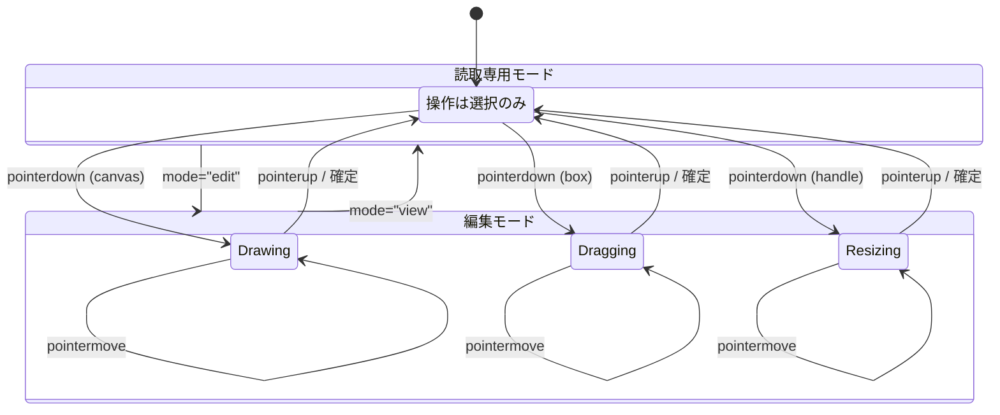
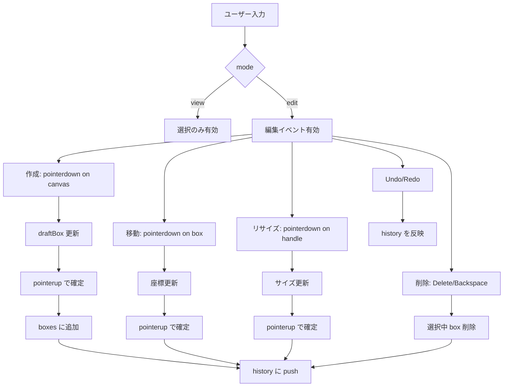

# 基本仕様（アノテーション作成・可視化アプリ）

## 目的
画像内物体検出／認識、画像内テキスト検出／認識向けのアノテーションデータを作成・可視化し、複数形式での入出力と比較を支援する。

## 対象データ
- 画像（JPEG/PNG/TIFF など）
- アノテーション
  - 物体検出：バウンディングボックス、ポリゴン、セグメンテーションマスク
  - テキスト検出：バウンディングボックス、四角形（四隅座標）
  - テキスト認識：文字列ラベル（行・単語・文字）

## 主要機能（モード別）
### 1. 作成・編集モード
- 画像上でアノテーションを作成（ボックス、ポリゴン、テキスト領域）
- 作成済みアノテーションの表示・編集・削除
- ラベル（クラス名/文字列）と属性（信頼度、タグ）の編集
- 画像とアノテーションを同時表示
- アノテーションの一覧表示（クラス/座標/文字列）
- クリックで対象領域へハイライト

### 2. 読取専用モード
- アノテーションデータを読み込み、画像とともに表示
- アノテーションの一覧表示（クラス/座標/文字列）
- クリックで対象領域へハイライト
- 編集操作は不可

### 3. 左右比較モード
- 2つのアノテーションデータを読み込み
- 画面左右に同一画像を表示し、各アノテーションをオーバーレイ表示
- 差分ハイライト
  - 位置差分（重なり率や中心距離による差分判定）
  - ラベル差分（クラス名/文字列の不一致）
- いずれかを正解データ（Ground Truth）として評価指標を算出
  - 検出率（例：Precision/Recall/F1）
  - 認識率（例：正解率/誤り率）
- テキスト正解比較（編集距離）
  - 正解情報がテキストの場合、編集距離（Levenshtein など）を計算
  - 比較表示（左右）
  - 差分の色分け表示
    - 挿入：緑
    - 置換：黄
    - 削除：赤

### 共通機能（全モード）
- 多様なフォーマット対応（読み込み/保存）
  - 入出力フォーマット例
    - COCO（JSON）
    - Pascal VOC（XML）
    - YOLO（TXT）
    - ICDAR（TXT/JSON）
    - 独自CSV/JSON（拡張ポイントとして定義）
  - 形式変換（読み込み → 保存）
  - マッピング設定（クラス名/ID、座標系、文字コード）

## 画面構成（例）
### 作成・編集モード／読取専用モード（共通UI）
- ツールバー（ファイル読込・保存）
  - 画像ファイルまたは画像ファイルパスの読み込み
  - アノテーションデータファイルの読み込み
  - アノテーションデータの保存（作成・編集モードのみ）
- キャンバス領域
  - 画像とアノテーション情報（矩形、クラスラベル、テキスト）の表示
    - 画像とアノテーション矩形は角丸なしで表示
  - 右下の領域にJSONプレビューを表示（デフォルトは非表示。スクロール可能）
### 補助領域（必要に応じて）
- 左ペイン：画像リスト/アノテーション一覧
- 右ペイン：プロパティ（ラベル/座標/属性）

### 左右比較モード
- 左右に共通UI（作成・編集モード／読取専用モードの画面構成）を並列配置
  - 各側にツールバーとキャンバス領域を配置
- 差分サマリ（全体の比較結果を集約表示）

## 非機能要件（最低限）
- 大量画像の読み込みに耐えるパフォーマンス
- Undo/Redo 対応
- 自動保存/バックアップ
- 日本語/英語 UI
- Webサーバー不要で、HTMLをブラウザで開くだけでローカル利用可能

## 技術スタック
- TypeScript + React で実装

## 受け入れ条件（例）
- 画像とアノテーションを同時に可視化できる
- 複数フォーマットで入出力できる
- 比較モードで左右に表示でき、差分が可視化される
- テキスト比較で挿入/置換/削除が色分けされる

## 用語
- アノテーション：画像内の物体/文字に付与されるラベルと領域情報
- 編集距離：2つの文字列の差分量を測る指標

---

# 各モードの詳細動作仕様

## 読取専用モード

### 画像・アノテーション読込の挙動
#### COCO / COCO-Text
- ユーザー操作
  - 「アノテーション読込」ボタンから、読込むアノテーションファイル(JSON)を選択
  - 「画像ルートフォルダー選択」ボタンから、画像ファイルのルートフォルダーを選択
- 画面描画
  - リスト領域には、アノテーションファイル内の`images`に含まれる画像ファイル名を表示
  - アノテーションファイルと画像ルートフォルダーの両方が指定されると、キャンバス領域に画像とアノテーション情報（矩形、クラスラベルorテキスト）を表示
  - リスト選択時は「画像ルートフォルダー + 選択した画像ファイル名」から画像を読込

#### Pascal VOC
- 1つのXMLに画像1枚分のアノテーションのみを想定
- ユーザー操作
  - アノテーションファイル読込時に複数XMLを同時選択可能（同一フォルダー内のXMLをまとめて選択）
  - 「画像ルートフォルダー選択」ボタンから、画像ファイルのルートフォルダーを選択
- 画面描画
  - リスト領域には、選択されたXMLファイル名を一覧表示
  - アノテーションファイルと画像ルートフォルダーの両方が指定されると、キャンバス領域に画像とアノテーション情報（矩形、クラスラベルorテキスト）を表示
- リスト選択時は、該当XMLを読み直し、内部の画像ファイル名と画像ルートフォルダーを結合して画像を読込

## 作成・編集モード

### 新規作成時
- ユーザー操作
  - 「画像ファイル読込」ボタンから画像ファイルを選択（複数画像を同時選択可能）
  - 読み込んだ画像ファイルの親フォルダーを画像ルートフォルダーとして記憶
  
- 画面描画
  - リスト領域には、選択された画像ファイル名を一覧表示
  - リスト選択時は、選択した画像ファイル名と画像ルートフォルダーを結合して画像を読み込んでキャンバス領域に描画

### 編集時
- ユーザー操作
  - アノテーションファイル読込及び画像ルートフォルダー選択は、読み取り専用モードと同じ
  - 
- 画面描画
  - リスト領域には、選択された画像ファイル名を一覧表示
  - キャンバス領域に、選択された画像を読み込んで描画
  - リスト選択時は、選択した画像ファイル名と画像ルートフォルダーを結合して画像を読込

### 新規作成時・編集時共通
- ユーザー操作
  - [未実装] 画像上をマウスドラッグしてアノテーション矩形の追加が可能
  - [未実装] クリックで選択した矩形座標の調整およびクラスラベルorテキストの編集が可能
  - [未実装] 矩形を選択した状態でDeleteキーを押すと、矩形の削除が可能

---

# 作成／編集モード 詳細設計（案）

## 状態構造
- `mode`: `"view" | "edit"`
- `image`
  - `url`, `name`, `metrics`（natural / display）
- `annotations`
  - `boxes: AnnotationBox[]`（単一ソース）
  - `selectedId: string | null`
  - `draftBox?: AnnotationBox`（作成中）
- `history`
  - `past: AnnotationBox[][]`
  - `future: AnnotationBox[][]`
- `ui`
  - `zoom: number`
  - `pan: { x: number; y: number }`
  - `showAnnotationPanel: boolean`
  - `status: "idle" | "drawing" | "dragging" | "resizing"`

## 状態遷移（mermaid）

## イベントフロー（mermaid）

## UI配置
- ツールバー
  - モード切替トグル（読取専用 / 作成・編集）
  - 保存ボタン（編集モードのみ有効）
  - Undo / Redo
- キャンバス
  - 画像 + オーバーレイ（共通）
  - 編集モードのみ
    - 選択枠・リサイズハンドル
    - 作成中の`draftBox`表示
- サイドバー
  - 画像/アノテーション一覧（共通）
- 右下パネル
  - JSONプレビュー（共通）

---

# history管理・座標変換（ズーム/パン）の詳細

## history管理（Undo / Redo）
### 状態
- `history.past: AnnotationBox[][]`
- `history.future: AnnotationBox[][]`

### ルール
- 変更確定時（`pointerup` / `Delete` など）に
  - `past.push(deepClone(boxes))`
  - `future = []`
- Undo
  - `future.push(current)`
  - `boxes = past.pop() ?? current`
- Redo
  - `past.push(current)`
  - `boxes = future.pop() ?? current`

### 最適化
- `past`の最大サイズを設定（例: 100）
- `deepClone`は `structuredClone` または `map` で複製

## 座標変換（ズーム / パン）
### 座標系
- `image`座標: 元画像（自然サイズ）
- `screen`座標: 画面表示座標

### 状態
- `ui.zoom: number`（例: 0.2〜5）
- `ui.pan: { x: number; y: number }`

### 変換式
- `screen = (image * zoom) + pan`
- `image = (screen - pan) / zoom`

### ポインタ座標取得
- `rect = canvas.getBoundingClientRect()`
- `screen = { x: e.clientX - rect.left, y: e.clientY - rect.top }`
- `image = toImage(screen)`

### ズーム（Ctrl + Wheel）
- 基準点はマウス位置
- 変更前後で同一点が固定されるよう `pan` を補正
  - `before = toImage(mouseScreen)`
  - `zoom = clamp(zoom * factor)`
  - `after = toScreen(before)`
  - `pan += mouseScreen - after`

### パン
- 中ボタンまたは `Space + Drag`
- `pan += deltaScreen`

## 編集操作と座標
### 作成
- `startImage = toImage(mouseDownScreen)`
- `currentImage = toImage(mouseMoveScreen)`
- `box = normalize(startImage, currentImage)` で確定

### 移動
- `deltaImage = deltaScreen / zoom`
- `box.x += deltaImage.x` / `box.y += deltaImage.y`

### リサイズ
- ハンドル位置を `image`座標で更新
- `minSize`（例: 4px）を `image`座標で適用
